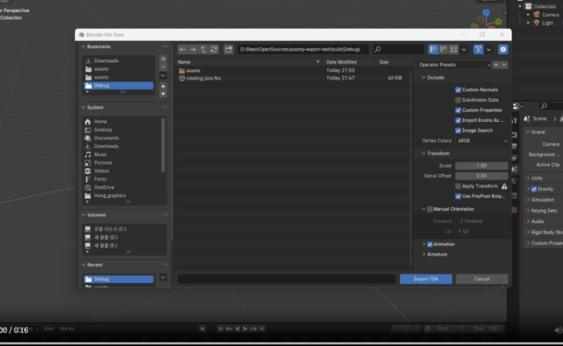
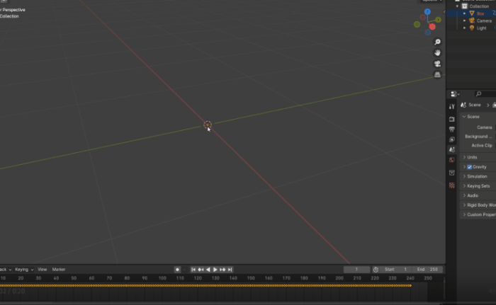

# Assimp fbx import/export test

## issue 5711, 4556 to_ktime 

- https://github.com/assimp/assimp/issues/5711#issue-2461452256
- https://github.com/assimp/assimp/issues/4556

```cpp
// FBExporter.cpp   inline int64_t to_ktime(double ticks, const aiAnimation* anim) 
    // before logic
    return (static_cast<int64_t>(ticks / anim->mTicksPerSecond)) * FBX::SECOND;
    // after logic
    return (static_cast<int64_t>(ticks / anim->mTicksPerSecond * FBX::SECOND)) ;
```

Casting to int64_t truncates the value. Animation data is not exported properly.

```
ticks: 0 ticks/tickpersecond: 0         before: 0            after: 0
ticks: 1 ticks/tickpersecond: 0.0416667 before: 0            after: 1924423250
ticks: 2 ticks/tickpersecond: 0.0833333 before: 0            after: 3848846500
ticks: 3 ticks/tickpersecond: 0.125     before: 0            after: 5773269750
ticks: 4 ticks/tickpersecond: 0.166667  before: 0            after: 7697693000
ticks: 5 ticks/tickpersecond: 0.208333  before: 0            after: 9622116250
ticks: 6 ticks/tickpersecond: 0.25      before: 0            after: 11546539500
ticks: 7 ticks/tickpersecond: 0.291667  before: 0            after: 13470962750
ticks: 8 ticks/tickpersecond: 0.333333  before: 0            after: 15395386000
ticks: 9 ticks/tickpersecond: 0.375     before: 0            after: 17319809250
ticks: 10 ticks/tickpersecond: 0.416667 before: 0            after: 19244232500
ticks: 11 ticks/tickpersecond: 0.458333 before: 0            after: 21168655750
ticks: 12 ticks/tickpersecond: 0.5      before: 0            after: 23093079000
ticks: 13 ticks/tickpersecond: 0.541667 before: 0            after: 25017502250
ticks: 14 ticks/tickpersecond: 0.583333 before: 0            after: 26941925500
ticks: 15 ticks/tickpersecond: 0.625    before: 0            after: 28866348750
ticks: 16 ticks/tickpersecond: 0.666667 before: 0            after: 30790772000
ticks: 17 ticks/tickpersecond: 0.708333 before: 0            after: 32715195250
ticks: 18 ticks/tickpersecond: 0.75     before: 0            after: 34639618500
ticks: 19 ticks/tickpersecond: 0.791667 before: 0            after: 36564041750
ticks: 20 ticks/tickpersecond: 0.833333 before: 0            after: 38488465000
ticks: 21 ticks/tickpersecond: 0.875    before: 0            after: 40412888250
ticks: 22 ticks/tickpersecond: 0.916667 before: 0            after: 42337311500
ticks: 23 ticks/tickpersecond: 0.958333 before: 0            after: 44261734750
ticks: 24 ticks/tickpersecond: 1        before: 46186158000  after: 46186158000
```

|before | after|
|-|-|
| | |
